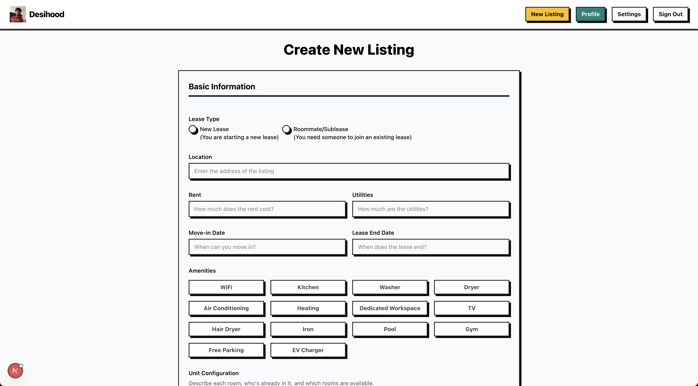

# 🏠 DesiHood - Find Your Desi Community

A modern web application designed to help members of the desi community find roommates and apartments that match their lifestyle and preferences. Built with Next.js 15, React 19, and Supabase.

<p align="center">
  
</p>

## ✨ Features

### 🔍 **Smart Search & Filtering**

- Advanced filtering by city, budget range, lease type, and move-in date
- Amenity-based search (WiFi, Kitchen, Washer, Dryer, etc.)
- Location-based roommate matching

<p align="center">
  
</p>

### 👥 **User Management**

- Secure authentication with Supabase
- User profiles and preferences
- Onboarding flow for new users

<p align="center">
  
</p>

### 🏢 **Listing Management**

- Create detailed apartment listings
- Upload multiple photos
- Specify room configurations and amenities
- Set pricing and availability

<p align="center">
  
</p>

<p align="center">
  
</p>

<p align="center">
  
</p>

### 📱 **Modern UI/UX**

- Responsive design for all devices
- Beautiful, intuitive interface
- Tailwind CSS for styling
- Radix UI components for accessibility

## 🚀 Tech Stack

### **Frontend**

- **Next.js 15** - React framework with App Router
- **React 19** - Latest React with concurrent features
- **Tailwind CSS 4** - Utility-first CSS framework
- **Radix UI** - Accessible component primitives
- **Lucide React** - Beautiful icons
- **React Hook Form** - Form handling with validation
- **Zod** - Schema validation
- **Zustand** - State management

### **Backend & Database**

- **Supabase** - Backend-as-a-Service
- **PostgreSQL** - Database
- **Row Level Security** - Data protection
- **Real-time subscriptions** - Live updates

### **Development Tools**

- **ESLint** - Code linting
- **Turbopack** - Fast development builds
- **PostCSS** - CSS processing

## 📋 Prerequisites

Before running this project, make sure you have:

- **Node.js** 18.17 or later
- **npm** or **yarn** package manager
- **Supabase account** and project setup

## 🛠️ Installation

1. **Clone the repository**

   ```bash
   git clone https://github.com/yourusername/desihood.git
   cd desihood
   ```

2. **Install dependencies**

   ```bash
   npm install
   # or
   yarn install
   ```

3. **Environment Setup**
   Create a `.env.local` file in the root directory:

   ```env
   NEXT_PUBLIC_SUPABASE_URL=your_supabase_project_url
   NEXT_PUBLIC_SUPABASE_ANON_KEY=your_supabase_anon_key
   SUPABASE_SERVICE_ROLE_KEY=your_supabase_service_role_key
   ```

4. **Database Setup**
   - Set up your Supabase project
   - Configure authentication providers
   - Set up database tables and RLS policies

## 🚀 Running the Application

### **Development Mode**

```bash
npm run dev
# or
yarn dev
```

Open [http://localhost:3000](http://localhost:3000) in your browser.

### **Production Build**

```bash
npm run build
npm start
```

### **Linting**

```bash
npm run lint
```

## 🏗️ Project Structure

```
src/
├── app/                    # Next.js App Router
│   ├── auth/              # Authentication routes
│   ├── listings/          # Roommate/apartment listings
│   ├── new-listing/       # Create new listings
│   ├── onboarding/        # User onboarding flow
│   ├── profile/           # User profiles
│   └── settings/          # User settings
├── components/            # Reusable UI components
├── lib/                   # Utility functions
├── providers/             # React context providers
├── stores/                # Zustand state stores
├── styles/                # Global styles
└── utils/                 # Helper functions
```

## 🔐 Authentication

The application uses Supabase for authentication with:

- Email/password signup and login
- Session management
- Protected routes
- User profile management

## 🎨 UI Components

Built with a component library including:

- **Form Components**: Input, TextArea, Select, Checkbox, Radio Group
- **Layout Components**: Card, Button, Link
- **Interactive Components**: Slider, Switch, File Upload
- **Typography**: PrimaryText, SecondaryText, TertiaryText

## 📱 Responsive Design

- Mobile-first approach
- Responsive grid layouts
- Touch-friendly interactions
- Optimized for all screen sizes

## 🚀 Deployment

### **Vercel (Recommended)**

1. Connect your GitHub repository to Vercel
2. Set environment variables
3. Deploy automatically on push

### **Other Platforms**

- Netlify
- Railway
- DigitalOcean App Platform

## 🤝 Contributing

We welcome contributions! Please see our contributing guidelines:

1. Fork the repository
2. Create a feature branch (`git checkout -b feature/amazing-feature`)
3. Commit your changes (`git commit -m 'Add amazing feature'`)
4. Push to the branch (`git push origin feature/amazing-feature`)
5. Open a Pull Request

## 📄 License

This project is licensed under the MIT License - see the [LICENSE](LICENSE) file for details.

## 🙏 Acknowledgments

- Built with [Next.js](https://nextjs.org/)
- Styled with [Tailwind CSS](https://tailwindcss.com/)
- Powered by [Supabase](https://supabase.com/)
- Icons from [Lucide](https://lucide.dev/)

## 📞 Support

If you have any questions or need help:

- Create an [issue](https://github.com/yourusername/desihood/issues)
- Join our [discussions](https://github.com/yourusername/desihood/discussions)
- Contact us at [your-email@example.com]

---

**Made with ❤️ for the Desi community**
